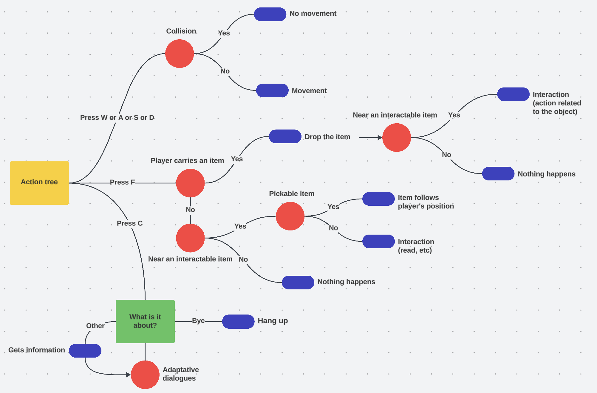
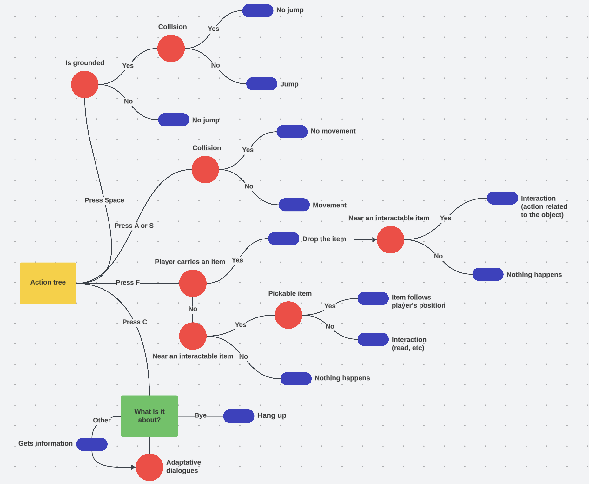
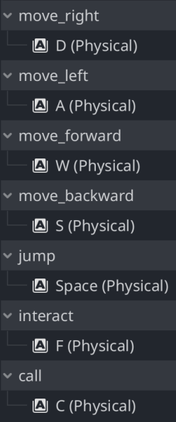

# Technical specifications

## Table of content

- [Technical specifications](#technical-specifications)
  - [Table of content](#table-of-content)
  - [Document purpose](#document-purpose)
- [Project definition](#project-definition)
  - [Overview](#overview)
  - [Team members](#team-members)
  - [Description](#description)
- [Development environment](#development-environment)
  - [Hardware](#hardware)
  - [Programming language](#programming-language)
  - [Conventions](#conventions)
    - [File tree and documents](#file-tree-and-documents)
    - [Code](#code)
      - [Naming conventions](#naming-conventions)
      - [Structure conventions](#structure-conventions)
- [Software architecture](#software-architecture)
  - [Game actions flow](#game-actions-flow)
  - [Software file management](#software-file-management)
    - [File tree](#file-tree)
    - [Files interactions](#files-interactions)
  - [Program structure](#program-structure)
- [Risks and mitigations strategy](#risks-and-mitigation-strategies)
  - [Risks](#risks)
  - [Mitigation strategies](#mitigation-strategies)
- [Glossary](#glossary)


## Document purpose

The purpose of this document is to describe how the program will be created. It will be updated following the advancements of the project, to match what has been done during the development phase.

# Project definition

## Overview

The project, given by ALGOSUP, is to create a serious game about climate change<sup><a href="#1">[1]</a></sup>. It has to teach what is creating the climate change and how to face it. More details about the project requirements and design are available in the [functional requirements documentation](../FunctionalSpecifications/functionalSpecifications.md).

## Team members

| Name | Role |
| -- | -- |
| Mathias GAGNEPAIN | Project manager |
| Enzo GUILLOUCHE | Program manager |
| Evan UHRING | Technical leader |
| Michel RIFF | Software engineer |
| Loïc NOGUES | Software engineer |
| Axel DAVID | Tech writer |
| Tino GABET | Quality assurance |

## Description

The game goal is to raise awareness about the climate change that the humanity is currently experiencing. To do so, here are the client requirements and our set objectives:

| Client requirements |
| -- |
| Create a serious game |
| Raise awareness about climate change |
| Use the Godot game engine |

| Our objectives |
| -- |
| Use 2D graphics (exterior: top-down view, interior: side view) |
| Teach climate change through puzzles and the knowledge-vania<sup><a href="#2">[2]</a></sup> mechanic |

# Development environment

## Hardware

In the team, two different types of computer are used:
  
| Computer | OS | Number used |
| -- | -- | -- |
| MacBook Air M3 | MacOS | 4 |
| ThinkBook 14 G4 | Windows 11 | 3 |

Thus, the game that we will create will work on Windows and MacOS operating systems only. 

## Programming language

For this project, the Godot engine will be used. We will develop the game using its own programming language, GDscript. Those are used because it is easy to use, to maintain and for its portability.

## Conventions

### File tree and documents
---

Folders are written in "CamelCase"<br>
Files are written in "pascalCase"

```md
2023-2024-project-2-serious-game-team-6
├─── Documents
│   ├─── FunctionalSpecifications
│   │   └─── functionalSpecifications.md
│   ├─── Management
│   │   └─── projectCharter.md
│   ├─── QualityAssurance
│   │   └─── testPlan.md
│   └─── TechnicalSpecifications
│       └─── technicalSpecifications.md
├─── Game
└─── Manuals
```

We will be using GitHub to keep track of our documents and game development.

> [!CAUTION]
> It is important to name correctly the push made on GitHub. Names like 'Updated [document name]' are not valid !

### Code
---

The code will follow the [GDscript conventions](https://docs.godotengine.org/en/3.0/getting_started/scripting/gdscript/gdscript_styleguide.html)

#### Naming conventions
---

| Type | Convention |
| -- | -- |
| Classes | PascalCase |
| Nodes | PascalCase |
| Functions | snake_case |
| Variables | snake_case |
| Constants | CONSTANT_CASE |

#### Structure conventions
---

Indentations<br>
└> Simple indentation for regular code block, double indentation for continuations.

>[!TIP]
> **Good**
> ```GDscript
>for i in range(10):
>    print("hello")
>
>effect.interpolate_property(sprite, 'transform/scale',
>        sprite.get_scale(), Vector2(2.0, 2.0), 0.3,
>        Tween.TRANS_QUAD, Tween.EASE_OUT)
> ```
>&nbsp;

>[!CAUTION]
> **Bad**
> ```GDscript
>for i in range(10):
>        print("hello")
>
>effect.interpolate_property(sprite, 'transform/scale',
>    sprite.get_scale(), Vector2(2.0, 2.0), 0.3,
>    Tween.TRANS_QUAD, Tween.EASE_OUT)
> ```
>&nbsp;

---

One statement per line<br>
└> Never combine multiple statements on a single line.

>[!TIP]
> **Good**
> ```GDscript
>if position.x > width:
>    position.x = 0
>
>if flag:
>    print("flagged")
> ```
>&nbsp;

>[!CAUTION]
> **Bad**
> ```GDscript
>if position.x > width: position.x = 0
>
>if flag: print("flagged")
> ```
>&nbsp;

---

Whitespace<br>
└> Single whitespace around operators and after commas. No whitespace in dictionary references and function calls.

>[!TIP]
> **Good**
> ```GDscript
>position.x = 5
>position.y = mpos.y + 10
>dict['key'] = 5
>myarray = [4, 5, 6]
>print('foo')
> ```
>&nbsp;

>[!CAUTION]
> **Bad**
> ```GDscript
>position.x=5
>position.y = mpos.y+10
>dict ['key'] = 5
>myarray = [4,5,6]
>print ('foo')
>
>x        = 100
>y        = 100
>velocity = 500
> ```
>&nbsp;

# Software architecture

## Gameplay decision tree

Legend: 

- Red circle: conditions
- Blue oval: statements
- Green rectangle: dialogue box

For top-down view:


For side view:


## Software file management

### File tree

```md
Game
└─── ForsakenPlanet
      ├─── 2D
      │     ├─── Maps 
      │     │     ├─── Resources
      │     │     │     └─── (map sprites and other assets)
      │     │     └─── (every complete 2D playable maps)
      │     ├─── Objects 
      │     │     ├─── Interactions
      │     │     │     └─── (interactions logic)
      │     │     └─── (interactable objects)
      │     └─── Player 
      │           └─── (player model with camera for side view)
      ├─── 3D
      │     ├─── Maps 
      │     │     ├─── Resources
      │     │     │     ├─── Models
      │     │     │     │     └─── (cube model files)
      │     │     │     └─── (cube models map)
      │     │     └─── (every 3D playable maps)
      │     ├─── Objects 
      │     │     ├─── Interactions
      │     │     │     └─── (interactions logic)
      │     │     └─── (interactable objects)
      │     └─── Player 
      │           └─── (player model with camera for top-down view)
      └─── Sprites
            ├─── CubeTextures
            │     └─── (textures for the cube models)
            ├─── Player
            │     └─── (player sprites)
            └─── Fonts
                  └─── (fonts)
```

## Program structure

### Map creation

While our game is created using two different modes of camera, one being a top-down view and a side view, the maps will be made differently depending on the view that will be used for said map.<br>
So, the maps will be created using 3D for the top-down view, and complete 2D for the side view.
For the top-down view, the maps will be created using blocks and slopes. Buildings, environmental assets and props will be 2D sprites.
For the side view, maps will be in complete 2D with multiple layers. One for the collisions with the player, one for the interactables and a last one for the background. 

### User inputs

For the player to move, interact and more, inputs have to be set. Here is the list of the different inputs for the game:


###### *Other inputs could be added later in the development phase*

Those set buttons are done using a QWERTY keyboard<sup><a href="#3">[3]</a></sup>

### Player movement

Because of two different camera views, the movement available for the player will be different.<br>
For the top-down view, the player will be able to move forward, backward, left and right. Here is the movement handling, where we select first the direction, then we apply the movement speed and the gravity:

```GDscript
var input_dir = Vector3.ZERO
if Input.is_action_pressed("move_forward"):
	input_dir.z -= 1
if Input.is_action_pressed("move_backward"):
	input_dir.z += 1
if Input.is_action_pressed("move_left"):
	input_dir.x -= 1
if Input.is_action_pressed("move_right"):
	input_dir.x += 1

input_dir = input_dir.normalized() # Not going faster diagonally
velocity.x = input_dir.x * MOVE_SPEED
velocity.z = input_dir.z * MOVE_SPEED
velocity.y = -10 # How fast to snap on floor
```

The player will have to use the 'W', 'A', 'S' and 'D' buttons on a QWERTY keyboard.

For the side view, the player will loose the forward and backward movements, but be able the jump. Here is the sideway movement handling:

```GDscript
var direction := Input.get_axis("move_left", "move_right")
if direction:
	velocity.x = direction * SPEED
else:
	velocity.x = move_toward(velocity.x, 0, SPEED)
```

And here is the jump handling:

```GDscript
# Handle jump.
if Input.is_action_just_pressed("jump") and is_on_floor():
	velocity.y = JUMP_VELOCITY

# Add the gravity.
if not is_on_floor():
	velocity += get_gravity() * delta
```

The player will have to use the 'A', 'D' and 'Space' buttons on a QWERTY keyboard.

For each type of movement, a last function named 'move_and_slide()', which is a built in function, is called to apply the movement.

### Object interactions

For the interactions with the objects, the player will have to be close enough to it to be able to interact with it. Then after being close enough to the object, the player will be able to pick up or interact with the closest object. The input to interact with objects is the 'F' button on the keyboard.<br>
First here is the code seeking for the closest object:

```GDscript
# Track the closest interactable and currently held object
var cached_closest: Interactable
var held_object: RigidBody3D = null

func _ready() -> void:
	controller = player

# Update the closest interactable object in each physics frame
func _physics_process(delta: float) -> void:
	var new_closest: Interactable = get_closest_interactable()
	if new_closest != cached_closest:
		if is_instance_valid(cached_closest):
			unfocus(cached_closest)
		if new_closest:
			focus(new_closest)
		cached_closest = new_closest

# Handle area exit events
func _on_area_exited(area: Interactable) -> void:
	if cached_closest == area:
		unfocus(area)
```

Then when the player tries to interact with the object:

```GDscript
# Handle interaction inputs
func _input(event: InputEvent) -> void:
	if event.is_action_pressed("interact"):
		if cached_closest:
			# Check if interacting with a Sheet
			if cached_closest.get_parent() is Sheet:
				interact_with_sheet(cached_closest.get_parent())
			elif held_object:
				# If holding an object, interact with the bin
				if cached_closest.get_parent() is Bin:
					interact_with_bin(cached_closest.get_parent())
				else:
					# Release the held object
					release_held_object()
			else:
				# Interact with an object, a bin, the teleporter
				if cached_closest.get_parent() is Bin:
					interact_with_bin(cached_closest.get_parent())
				elif cached_closest.get_parent() is RigidBody3D:
					grab_object(cached_closest.get_parent() as RigidBody3D)
				elif cached_closest.get_parent() is Teleporter:
					interact_with_teleporter(cached_closest.get_parent())

# Grab a new object
func grab_object(object: RigidBody3D) -> void:
	if object:
		# Release the currently held object first (if any)
		release_held_object()
		# Grab the new object
		object.hold(player)
		held_object = object
```

Also, if the player already has an object, he drops it when trying to take an other object or when he presses the interaction button with nothing around:

```GDscript
# Release the currently held object
func release_held_object() -> void:
	if held_object:
		held_object.place_on_ground()
		held_object.release()
		held_object = null
```

The player will not be able to hold more than one item at a time.

### Other interactions

Same for the object interactions, the player will have to be close enough to what can be interacted with. The distance detection is the same, and the interaction action is shared with the one for the objects while being adapted for the correct interaction.

### Call

The player will be able to call the scientist to get information on things needed, if he has unlocked what he can have information on. To do so, the player will have to press the 'C' button on the keyboard.

### Changing zone

While there are multiple different zones, the player has to be able to go to each zone. To do so, the player has to interact with a teleporter. Then the player will get teleported to the chosen zone:

```GDscript
func _on_interactable_interacted(interactor: Interactor) -> void:
	add_highlight()
	#need to ask confirmation to the player
	get_tree().change_scene_to_file("[destination]")
```

On the last line, [destination] has to be changed depending on where the player is.

# Risks and mitigation strategies

## Risks

- 1. **Cross-platform compatibility issues**<br>
The game will be developed for both MacOS and Windows, but there may be compatibility issues due to different system configurations, performance variations, or input methods between the two platforms. This could lead to bugs or unexpected behavior when the game is run on one platform but not the other.
- 2. **Performance Optimization**<br>
The game involves both 2D and 3D components, which could strain system resources, especially on lower-end devices. Complex scenes, interactions, and animations may cause frame rate drops or lag, impacting the player experience.
- 3. **Godot Engine Limitations**<br>
Although Godot is a versatile engine, it may not fully support some advanced features or optimizations that are needed for high-quality visual effects or complex game mechanics, which could limit the project’s scope or result in suboptimal performance.
- 4. **Code and Documentation Inconsistencies**<br>
The team might not consistently adhere to the naming and structure conventions outlined in the documentation. This could lead to confusion, difficult code maintenance, and issues during collaborative development.
- 5. **Input Device Variability**<br>
The game is currently designed with a QWERTY keyboard layout in mind, but this might limit accessibility for players using different keyboard layouts or input devices, affecting the game’s reach and usability.
- 6. **Game Logic Bugs**<br>
As the game involves intricate interactions with objects and the environment, there may be bugs or edge cases in the game logic, such as incorrect object interaction detection, movement glitches, or problems with triggering the right scenes.
- 7. **Learning Curve for Team Members**<br>
Not all team members might be equally familiar with the Godot engine or GDscript, leading to slower development, potential coding errors, or miscommunication about the game’s design requirements.
- 8. **Delayed Asset Creation**<br>
Since the game involves numerous 2D and 3D assets, delays in asset creation, such as models, textures, or animations, could hinder the development timeline.

## Mitigation strategies

- 1. **Cross-platform Compatibility Testing**<br>
Implement a robust testing process that includes frequent cross-platform builds and checks. Utilize virtual machines or cloud-based platforms to emulate various devices and operating systems to catch potential compatibility issues early.
- 2. **Performance Profiling and Optimization**<br>
Regularly profile the game’s performance and optimize both the game code and assets (e.g., reduce polygon counts, texture sizes, and implement Level of Detail (LOD) techniques). Focus on optimizing heavy scenes and interactions to ensure smooth gameplay on different hardware.
- 3. **Utilize Godot’s Asset Management Features**<br>
Take advantage of Godot’s built-in tools and optimizations to reduce memory usage and improve scene management. Work around engine limitations by integrating external libraries or adjusting the game’s design to fit within the engine’s capabilities.
- 4. **Strict Adherence to Conventions and Code Reviews**<br>
Enforce code reviews and use linters or other automated tools to ensure the team adheres to the naming and structure conventions. Keep documentation updated with code examples and ensure that all team members understand and follow the standards.
- 5. **Flexible Input Handling**<br>
Implement input remapping features and ensure that the game supports non-QWERTY keyboard layouts. Consider adding support for other input devices such as game controllers or touchscreens, depending on the game’s final distribution.
- 6. **Comprehensive Testing of Game Logic**<br>
Implement extensive automated and manual testing, especially focusing on edge cases in game logic (e.g., object interactions, movement detection, and scene transitions). Use mockups or prototypes to test game mechanics early on and debug as you go.
- 7. **Training and Knowledge Sharing for Team Members**<br>
Provide training sessions and internal documentation to ensure that all team members are proficient with the Godot engine and GDscript. Encourage team collaboration and peer reviews to resolve technical challenges efficiently.
- 8. **Asset Creation Schedule and Buffer Time**<br>
Create a detailed asset creation and integration schedule, allowing for buffer time in case of delays. Ensure that asset creation is prioritized and that the team has the necessary tools (e.g., 2D/3D modeling software, animators) to create high-quality content within deadlines.

# Glossary

| Word | Definition | Source |
| --- | --- | --- |
| <a id="1">[1]</a>: Climate change | Climate change refers to long-term shifts in temperatures and weather patterns. | [United Nations](https://www.un.org/en/climatechange/what-is-climate-change) |
| <a id="2">[2]</a>: Knowledge-vania | Knowledge-vania is a game genre, based on knowledge to go further in the game |  |
| <a id="3">[3]</a>: QWERTY keyboard | A QWERTY keyboard is an english layout for the keyboard. | [wikipedia](https://en.wikipedia.org/wiki/QWERTY) |