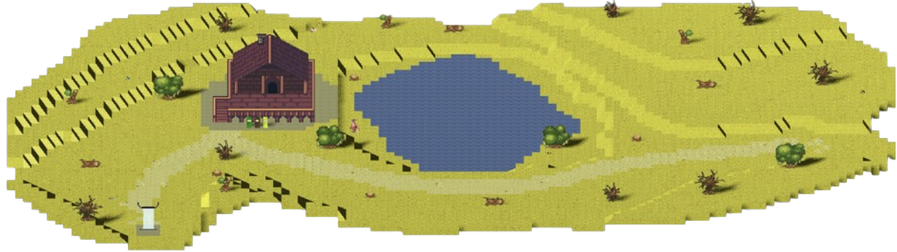

# User-manual

| Authors       | Axel David |
| ------------- | ---------- |
| Created       | 02/12/2024 |
| Last Modified | 13/12/2024 |

## Table-of-Contents
- [User manual](#user-manual)
- [Table of Contents](#table-of-contents)

- [Your adventure begins](#your-adventure-begins)
- [Basic controls](#basic-controls)
- [Object of the game](#object-of-the-game)

- [About puzzles](#about-puzzles)
- [About zones](#about-zones)
- [Characters](#characters)

- [Hub](#hub)
- [Narrative & Lore](#narrative-lore)
- [Mechanics](#mechanics)

- [Team 6 Credits](#team-6-credits)

### your-adventure-begins	

**The beginning :**

You start your journey in a spaceship on 

a planet you don’t know about... Working 

in a pair with a scientist, he has a 

task for you ! You will have to explore this planet to understand how it has fallen.

Thothan, the scientist, believes the key to the planet’s mystery lies in its ancient ruins, and it’s up to you to uncover the truth.

 Good luck, explorer. Your journey begins now.

### basic-controls

| Controls             |               |               |
| -------------------- | ------------- | ------------- |
| Action               | QWERTY layout | AZERTY layout |
| Move Up              | W             | Z             |
| Move Down            | S             | S             |
| Move Left            | A             | Q             |
| Move Right           | D             | D             |
| Intercat             | F             | F             |
| Call                 | C             | C             |
| Menu/Settings Access | Esc           | Esc           |

### object-of-the-game

**Set out for a journey in a dystopian earth...**

The object of the game is to learn about ecology. To do so you will have to discover how a lack of consideration of ecology has lead to the fall of a civilization.

**Explore and learn!**

Through the game you will have to face puzzles in multiples zones. Theses puzzles will teach you about recycling, energy, global warming and importance of flora. You will also find more information in the pieces of lore hidden in the different zones.

### about-puzzles

**Recycling (forest)**

The first puzzle you face will ask you to sort wastes. To do so, you will have to find wastes and put them in the good bins. To help you, you will find an information sheet that tells you how to sort wastes. By doing it right you will be able to see the nature coming back, to access the next zone and even find something new related to the lore.

**Energy (nuclear power plant)**

The second puzzle will ask you to reactivate a nuclear reactor. To do so, you will find wires and panels to put at the right place. To help you, you will find an information sheet that tells you how to do and gives you information about the different sources of energy and how do they pollute. By doing it right you will be able to supplies energy to several elements within the different areas, access new zones and even find something new related to the lore.

**Global warming (desert)**

The third puzzle you face will ask you to reactivate CO2 scrubbers. To do so, you will find CO2 scrubbers' panel to put at the right place. To help you, you will find an information sheet that tells you how to do it and will explain why CO2 has a major role in global warming. By doing it right you will be able to reduces the CO2 rate in the air, reducing the overall temperature so you can explore the zone in depth and even find something new related to the lore.

**Restore flora (desert)**

The fourth puzzle you face will ask you to plant the seeds that you found in the forest. To do so, you will have to plant seeds in the desert. To help you, the scientist will give you the related information, you will also find an information sheet that tells you the importance of flora for life. By doing it right you will be able to revitalize the area and even find something new related to the lore.

### about-zones

**Game zones**

The game is divided in three zones (forest, nuclear power plant, desert). You will have to pass the puzzles of each zones before going to the next one. You will also be able to find pieces of lore within the zones.

### characters

**The scientist**

The scientist is named Thothan. He’s really thoughtful, observant, meticulous and always in search of new knowledge

**The protagonist**

The player is named Quireo. He’s really curious and wants to preserve knowledge and wisdom as much as he can.

### hub

**The base camp**

The hub is the first place you will discover when starting a new game. This place is the bridge between every zone due to the teleporter allowing you to travel through the map. You will also find a map of the planet and the scientist waiting to analyze your discoveries.

### narrative-lore

**Narrative**

By the 2040s, climate impacts from unchecked industrial growth were severe, despite advances in clean energy and technology. Efforts to reverse the damage, like CO2 scrubbers, came too late. By 2130, runaway climate change made Earth uninhabitable, with ecosystems collapsing and humanity wiped out—a stark warning of the cost of neglect and hubris.

**Lore**

You will find pieces of lore in the different zones. As they are hidden you will have to find them to learn more about the world you explore. The importance of the lore lies in the understanding you will have of the importance of ecology.

### mechanics

**Movement**

Top-Down View:

	Gravity is disabled in this view to create a grounded exploration experience, allowing the player to focus on navigation and interaction with the environment.

	The player can move freely in all four directions—north, south, east, and west—offering a broad field for outdoor exploration and precise control.

Side-Scroller View:

	Gravity is enabled, introducing jumping mechanics for indoor exploration. This vertical movement adds depth to indoor navigation and allows for platforming challenges.

	Limited to horizontal movement (left and right) to align with the side-scrolling perspective. Obstacles and gaps may require jumping to overcome.

Objects and Item Interaction

	Objects within both perspectives are non-physics-based and remain static until interacted with. This design ensures that items are easy to locate and interact with without requiring complex manipulation.

	Items can be collected when players approach and interact with them. This includes key items, collectibles, and objects necessary for puzzle-solving.

Actions and Interactions

	Interact: The player can interact with various elements within the game, including inscriptions, levers, collectible items, and locked doors. These interactions will either provide information, unlock new areas, or progress objectives.

	Call: During certain moments, the player can call the scientist NPC to get hints or directives from him, obtaining guidance for navigating the game world or solving puzzles. This mechanic adds a sense of companionship and progression without disrupting gameplay.

### team-6-credits

[PM] - Mathias GAGNEPAIN  
[PGM]- Enzo GUILLOUCHE  
[TL] - Evan UHRING  
[QA] - Tino GABET  
[SE] - Michel RIFF  
[SE] - Loïc NOGUES  
[TW] - Axel DAVID

## Thank you for reading !
## Have a nice game !

